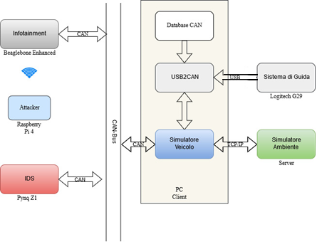

Simulatore CARLA
=========

Contenuto delle directory
---------
carla_simulator: Contiene il database dei messaggi CAN, i file di configurazione e la definizione delle classi usate
    usate dal simulatore
    
docs: Contiene la documentazione generata con sphinx

ids: Contiene la definizione delle classi utili ad implementare il sistema di IDS

script_bb: Contiene file di configurazione e script eseguiti sulla beaglebone

script_client: Contiene file di configurazione e script eseguiti sulla macchina client

script_pi: Contiene gli script per eseguire gli attacchi

script_pynq: Contiene file di configurazione e script eseguiti sulla pynq

Istruzioni d'uso
---------
I componenti dell'architettura sono disposti come in figura:

	

Per l'avvio della simulazione:
* Collegare punto-punto server e client tramite un cavo Ethernet (tale soluzione è necessaria per avere una latenza 
    piccola e quindi evitare fenomeni di lag)
* Scegliere e impostare gli indirizzi IP statici su client e server
* Modificare i parametri di interesse nel file *config.py* presente nella directory *carla_simulator*. In particolare
    è necessario impostare il percorso del file *.egg* di CARLA
* Collegare al client il convertitore USB-CAN e connettere il convertitore al bus CAN
* Collegare la beaglebone dotata del Cape Waveshare RS485-CAN al bus CAN
* Collegare la pynq (spenta) dotata del tranceiver al bus CAN e poi accenderla (è importante accendere la pynq dopo 
    averla collegata al bus altriemnti il controller CAN integrato potrebbe bloccarsi, in tal caso è necessario 
    riavviare la pynq)
* Avviare il Server

Sulla beaglebone:
* Alimentare la beaglebone tenendo premuto il pulsante "BOOT" sul cape
* Installare con apt i pacchetti dnsmasq (server DNS e DCHP) e hostapd (servizio per creare l'access point) e
    configurarli. In particolare nel file *dnsmasq.conf* è necessario impostare l'interfaccia su cui dnsmasq 
    sarà in ascolto e l'intervallo di indirrizzi IP che può assegnare, mentre nel file *hostapd.conf* è necessario
    impostare l'interfaccia su cui creare l'access point. Entrambi i file sono situati nella directory */etc*, i file 
    presenti nella directory *script_bb* sono solo delle copie
* Modificare i parametri di interesse nel file *config_bb.py*
* Assicurarsi che gli script *can1init.sh* e *init_wlan0.sh* abbiano i permessi di esecuzione
* Avviare lo script *ricezione_beaglebone.py* con permessi di amministratore (*sudo python3 ricezione_beaglebone.py*)

Sul client:
* Affinchè il convertitore USB-CAN possa essere usato deve essere installata la versione develop del modulo python-can.
    In alternativa, dopo aver installato python-can con pip, è possibile copiare la directory *seeedstudio*
    situata in *can\interfaces* della versione develop nella versione installata con pip. In *script_client* è
    possibile trovare una copia di tale directory
* Avviare lo script *Simulatore.py* passandogli come argomento i parametri desiderati (in particolare indirizzo ip e
    porta del server, l'elenco dei parametri si trova nella documentazione).
    
Sulla pynq:
* Installare il modulo pomegrante. Nel caso in cui non sia possibile installare il modulo tramite pip sarà necessario
    compilarlo direttamente sulla pynq. Le istruzioni si possono trovare all'indirizzo: 
    https://pomegranate.readthedocs.io/en/latest/install.html
* Eseguire in sequenza le istruzioni presenti nei notebook jupyter (in *bayes_net.ipynb* è implementata la rete
    bayesiana mentre in *CanPynq.ipynb* è implementato un sistema di log)

Sulla raspberry pi:
* Collegare la raspberry all'access point della beaglebone o comunque fare in modo che beaglebone e raspberry siano
    sulla stessa rete
* Impostare nello script *attack.py* indirizzo ip e porta su cui la beaglebone è in ascolto
* Lanciare lo script *attack.py*

Troubleshooting
---------
